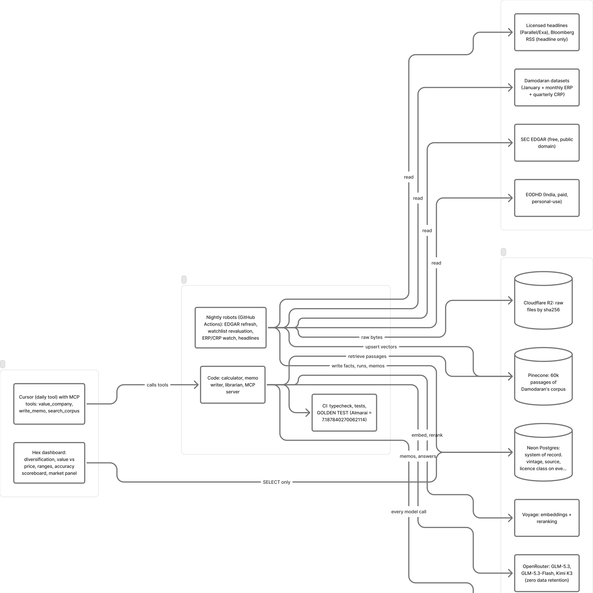
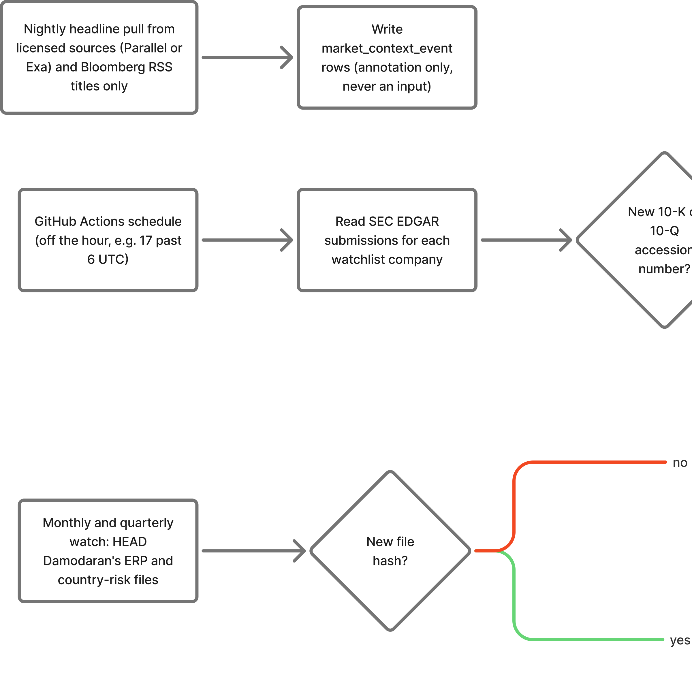
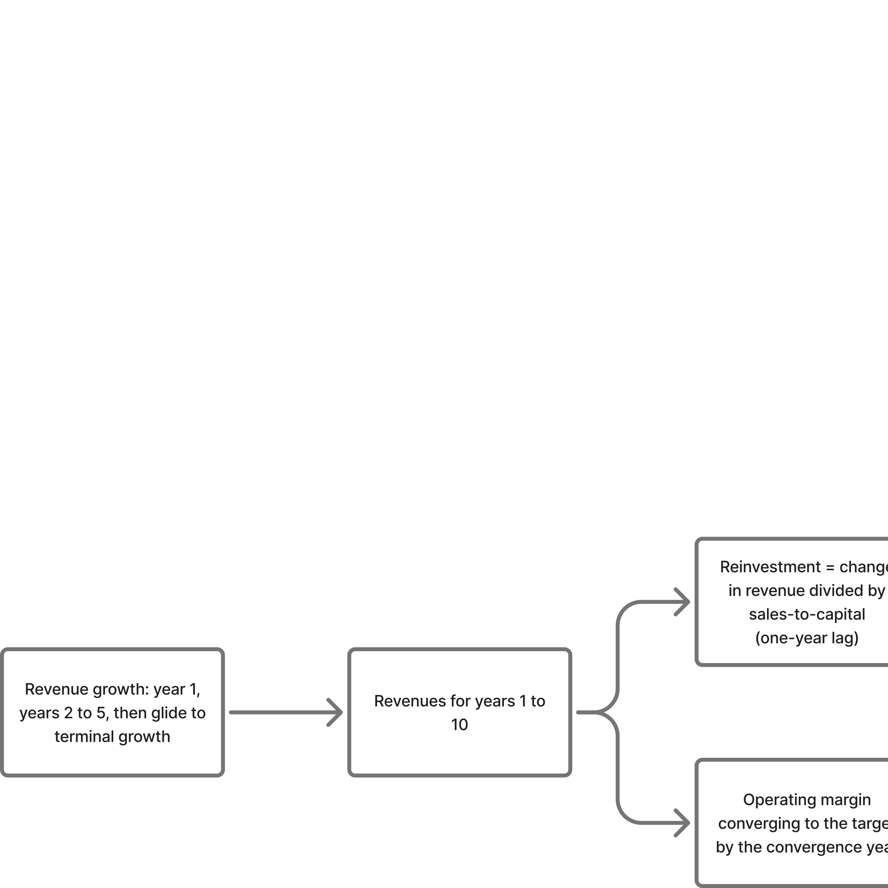
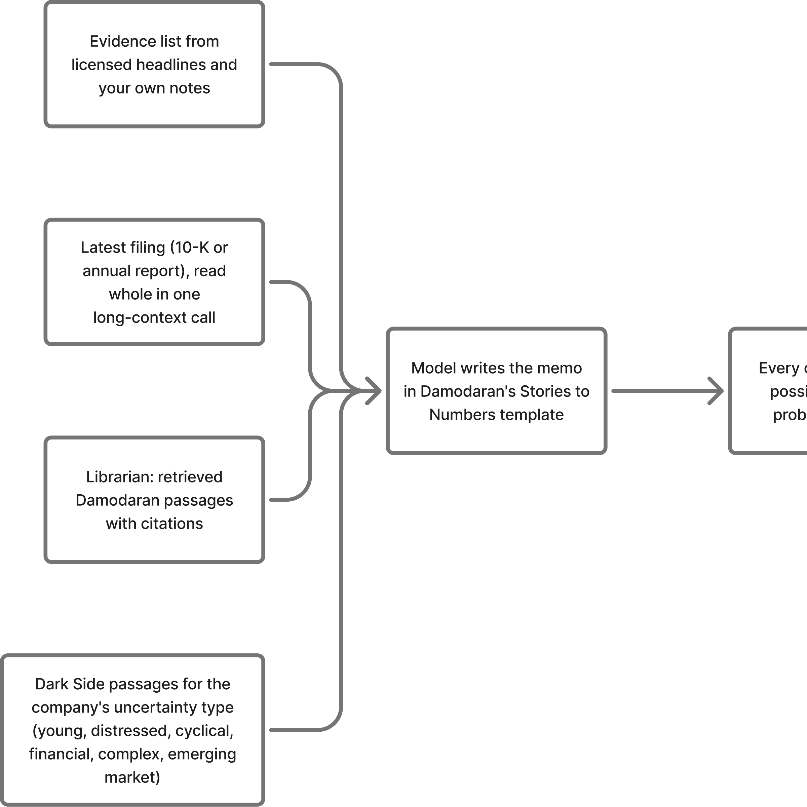
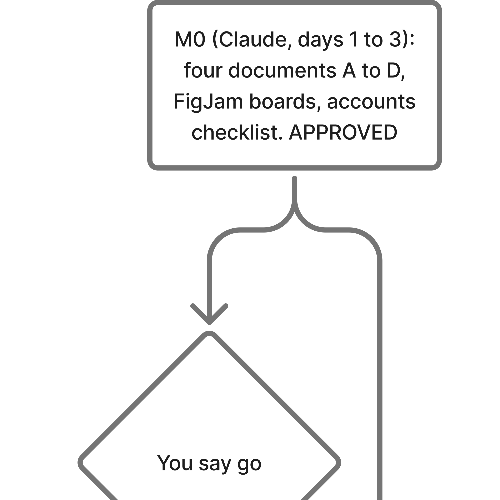

# How to use this document

Read it once, front to back, before you open Cursor or create any account. It is written for
someone who is new to software tooling and is relearning valuation. Every term is defined the
first time it appears, and there is a glossary at the end. When a section says "you will see",
that is literally what will appear on your screen.

The companion documents are:

- **Damodaran, the important parts** (`damodaran-essentials.pdf`): your revision brain-dump.
  Read it second, before anything technical.
- **Teaching Guide** (`guide.pdf`): where and how to learn each tool, one chapter per tool,
  in the order the project needs them.
- **The Other Side** (`other-side.pdf`): what Damodaran got wrong, who bet against him and
  won, and what the academics say. Read it after the essentials so the method never becomes
  a religion.

The diagrams in this document are also live boards in your Figma account (FigJam). Open them,
drag boxes around, add notes. They are yours.

| Board | Link |
|---|---|
| System architecture | https://www.figma.com/board/DtFTvDZeSQpuKLM5tavDUT |
| Nightly data flow | https://www.figma.com/board/6LSfZZfWAnbQVY0twr7OMw |
| The valuation chain | https://www.figma.com/board/SNaMV0lrKHeDRQgelrbPsp |
| The memo pipeline (story to numbers) | https://www.figma.com/board/LGcrXp6yT3fh4O2IV3mEY8 |
| The milestone map | https://www.figma.com/board/LXcGUT7C2ArsRkwsUvRBWt |

# 1. What we are building, in one page

You used to value one company at a time in Damodaran's spreadsheet. You want a machine that does
that for many companies, in India and the United States, with his lectures on tap, as a public
repo anyone can read, and with nothing running on your Mac except an editor. It has seven parts.

1. **A calculator.** A program that takes a company's numbers (revenue, operating income, debt,
   cash, shares) plus Damodaran's reference tables (industry betas, country risk premiums, the
   risk-free rate) and computes value per share exactly the way his spreadsheet does. His
   spreadsheet ships with a worked example: Almarai, a Saudi food company, value 7.187840270062114
   per share against a price of 72.28. Our program must reproduce that number to six decimal
   places before it is allowed to value anything else. We call that the **golden test**.
2. **A database in the cloud (Neon).** Every number the calculator uses is stored with three
   labels: where it came from (source), whether you may show it to other people (licence class),
   and which snapshot of Damodaran's data it belongs to (vintage). The database refuses to save a
   number that is missing any of the three.
3. **A librarian in the cloud (Pinecone and Voyage).** His 609 blog posts, lecture packets,
   book, datasets and transcripts are cut into about 60,000 passages. Each passage is turned into
   a list of numbers (a vector) so that a question can find the passages that talk about the same
   thing. Answers cite the passages they used.
4. **A memo writer.** Before the calculator runs on a company, a model reads the company's
   latest filing in one go, fetches the relevant Damodaran passages from the librarian, and writes
   a "story to numbers" memo in his own template. Every claim in the memo is labelled possible,
   plausible or probable. The memo says what the current price already assumes (a reverse DCF),
   names the kind of uncertainty the company carries (young, distressed, cyclical, financial,
   complex, emerging market) and proposes a value for every calculator input, with a citation to a
   filing page or a Damodaran passage. You review it, change what you disagree with, and approve.
   Only then does the calculator run. A second, opposing memo is required for every company.
5. **Robots that run at night (GitHub Actions).** Scheduled jobs pull new filings from the US
   regulator (SEC EDGAR, free), later from a paid Indian data feed (EODHD), re-value your
   watchlist, check whether Damodaran posted a new risk-premium file, pull licensed news
   headlines, and write everything to the database. Once a night is the right pace. Nothing here
   is intraday.
6. **A personal dashboard (Hex).** A hosted notebook over the same database shows watchlist
   diversification by sector and country, value-versus-price distributions, Monte Carlo ranges,
   an accuracy scoreboard (how past valuations did against later prices) and a descriptive "is
   the market on the rails" panel built from Damodaran's own implied risk-premium series. As your
   degree adds ideas, you add notebooks against the same tables.
7. **Your daily tool: Cursor.** You already pay for it. The system's tools plug into Cursor so
   you can type "value Trent", "write the memo for Apple" or "ask Damodaran why he strips the
   default spread out of the Indian risk-free rate". Cline, a free extension, sits in the same
   window as a bench for trying open-weight models. PDFs are only for reading offline.

# 2. Where the pieces live and who runs them

Everything except your editor runs on a managed service. You are the client; they are the
contractors. Here is each contractor, what it does in one line, and why it was chosen.

| Contractor | Job | In one line | Why this one |
|---|---|---|---|
| **GitHub** | Holds the code; runs the robots | A public folder in the cloud with a history of every change, plus computers that run scheduled jobs | Where the code has to live anyway; public repos get standard runners free |
| **Neon** | The database | Managed Postgres that switches itself off when idle, with a copy of your whole database per change request | Idle costs nothing; branches make experiments safe |
| **Pinecone** | The librarian's index | Stores the 60,000 passage vectors and finds the nearest ones to a question | Free at this size; purpose-built |
| **Voyage** | Turns text into vectors, reranks results | The model that understands "sales to capital" and "reinvestment efficiency" are neighbours | 200 million free tokens; embeds each passage aware of its neighbours, which rescues the unpunctuated transcripts |
| **OpenRouter** | One door to hundreds of AI models | One key, one bill; you swap a model by changing a name | Pin a model by name; logging stays off |
| **Cloudflare R2** | Raw files | The bucket that holds the spreadsheets, zips and OCR output, each named by its fingerprint (hash) | 10 GB free, no charge to read files back |
| **Langfuse** | Logs of every model call | Which model, which prompt, what it cost, what it returned | Free tier includes evaluations; open source |
| **Hex** | The dashboard | SQL and Python notebooks over Neon that turn into a personal dashboard of your watchlist | The only tool in budget with real Python and product-grade charts |
| **Mistral** | OCR, one-off | Turns three image-only lecture decks into text | Best independent score, about a dollar for the job |
| **EODHD** | Indian statements (from milestone 4) | Income statements, balance sheets and cash flows for NSE and BSE companies | Only vendor with documented long-history India data |
| **Cursor** | Your editor and agent | A VS Code with an AI that plans, edits and shows you every change as a diff | Already paid; safest for a beginner |

# 3. The six rules that make the numbers trustworthy

These are the rules that survive every redesign. They are about correctness, not style.

## 3.1 The golden test

Damodaran's spreadsheet contains a finished example (Almarai). Our calculator must reproduce its
value per share, 7.187840270062114, within 0.000001. The expected numbers are pulled out of the
workbook by a script, never typed by hand, and the file that holds them is protected so the AI
tool cannot "fix" the test instead of the code. Every code change runs this test automatically.
If it fails, the change is refused.

What it does and does not prove: it proves the *arithmetic* is faithful, including how an
industry beta is re-levered for the company's debt. It says nothing about whether the *inputs*
are right. That is why every valuation also carries a range (part 3.5).

## 3.2 Vintage

Damodaran refreshes his tables every January. Two of them refresh more often: the country risk
premiums quarterly, the implied equity risk premium monthly. So a single year contains several
versions of the risk-free rate and the risk premium. In the 2026 data alone there are three
risk-free rates (3.95%, 4.58%, 4.75%) and three mature-market risk premiums (4.20%, 4.23%,
4.46%). Mixing a January industry table with a September risk premium produces a confidently wrong
answer with no warning. So every valuation run stores three ids: which market file, which
country-risk file, which industry file. The database refuses a run without all three.

## 3.3 Source and licence class

Every stored fact records where it came from and one of seven licence classes:

| Class | Examples | May it appear in the librarian's index? | May it ever be shown to others? |
|---|---|---|---|
| `public_domain` | SEC EDGAR filings | yes | yes |
| `damodaran_public` | his datasets and posts | yes | yes, with attribution |
| `open_access` | RBI yields, arXiv, SSRN author copies | yes | yes |
| `asr_youtube` | auto-captions of his lectures | yes, marked as approximate wording | quote carefully |
| `licensed_personal` | EODHD, your broker's API | **no** | no, until a commercial licence |
| `proprietary_personal` | your Bloomberg reading notes | **no** | never |
| `link_only` | books, paid newsletters | **no** (we store the link) | link only |

A database rule refuses the last three from the index. The code is already public. This rule
keeps licensed facts out of the librarian and off any page a stranger can see: "can I show this?"
becomes a query.

## 3.4 The India rules

- The Indian risk-free rate is the 10-year government bond yield **minus** India's default
  spread. Otherwise sovereign risk is counted twice, because the cost of debt already adds it.
- Equity risk premium for an Indian company = mature-market premium + India's country premium.
  January 2026: 4.23% + 2.85% = 7.08% (rating Baa3, default spread 1.87%). July 2026: 6.92%.
- Damodaran publishes industry averages for India, but 27 of the 94 industries have fewer than
  10 Indian companies in them. When that happens the system uses the emerging-markets table,
  then the global table, and prints which one it used.

## 3.5 Ranges, not points

Every valuation also produces a sensitivity table and a Monte Carlo range drawn from Damodaran's
own industry quartiles. The scoreboard (part 6) later measures the bias and the spread of those
estimates against realised prices. Exact engine, uncertain inputs, measured error.

## 3.6 No advice

A test scans every report, memo and chat answer for buy, sell, hold or target price. The system
prints estimates (value, price as a percentage of value, the probability that value is below
price, what the price already requires, and how past calls did). It never tells you what to do.

# 4. The two places an AI model is used

This confused you, so here it is slowly.

**Place 1: while you write code.** That is Cursor. Cursor includes its own pool of models in the
subscription you already pay. You do not touch that. You do not paste any API key into Cursor:
doing so is unofficial, switches off half its features, and puts the key into logs. Cursor
Privacy Mode is not a secrecy guarantee. Prompts leave your machine. This repo is public.

**Place 2: inside the product, when it runs.** Our own code calls a model to write memos, answer
questions from the librarian, and clean transcripts. Those calls go through OpenRouter with
prompt logging off. Zero-data-retention routing is optional hygiene for licensed filings, not a
claim that the project is secret. Here the open-weight models go, because
this is where the volume and the cost are, and because a model pinned to an exact checkpoint keeps
a 2026 valuation reproducible in 2029.

"Open-weight" means the model's weights are downloadable by anyone and hosted by many companies,
so no single vendor can switch you off. They are 7 to 40 times cheaper per token than the frontier
models. The cost is capability: on the Artificial Analysis Intelligence Index v4.3 (7 September
2026) the frontier scores 53 and the best open-weight model (GLM-5.3) 45. The gap sits in long
autonomous coding tasks, not in the "read a filing and extract" work that dominates a valuation
pipeline.

## 4.1 The model table, explained line by line

| Job | Model (OpenRouter id) | Price per million tokens, in / out | Why |
|---|---|---|---|
| Write memos, answer questions | `z-ai/glm-5.3` | about $0.92–1.40 / $3.14–4.40 | Best open-weight model on the index (45) and the lowest hallucination rate among strong open weights |
| Bulk cleaning (punctuating transcripts, tagging passages) | `z-ai/glm-5.3-flash:batch` | $0.075 / $0.25 | Half price for non-urgent work; the whole transcript job costs about $11 once. Reasoning must be switched off or "thinking" tokens are billed as output |
| Judge (grading the librarian's answers in evaluations) | `moonshotai/kimi-k3` | $2.65 / $13.28 | Best-calibrated open-weight model (it abstains rather than invents); the judge must never be the model being judged |
| Fallback | `deepseek/deepseek-v4.1-flash` | $0.15 / $0.60 | Fastest in class, permissive licence |
| Never | DeepSeek V4 Pro | | 94% hallucination rate on the knowledge test, disqualifying for a citation-bearing chat |

How to read the columns: "tokens" are word pieces (roughly 4 characters). "In" is what you send,
"out" is what the model writes. A typical librarian answer sends about 8,000 tokens and gets 700
back, so it costs about $0.0143 on GLM-5.3. The model ids and prices are re-checked monthly and
pinned in one file; a swap is one line.

# 5. What "scales", in plain words

You asked whether this design scales. Here is what scales for free and what does not.

**Scales for free:** the calculator (a pure function; a thousand companies is a thousand calls),
the librarian (a question costs the same whether the index holds 30 million or 300 million
tokens, because it only fetches 8 passages), the robots (GitHub can run up to 256 jobs at once),
the dashboard (it only reads).

**Does not scale by itself, and the fix:** the database's single write endpoint (write in
batches, never one row at a time); the regulator's rate limit (about 10 requests per second, so
the robots only fetch a company when a *new* filing exists, never everything every night); the
Indian data vendor's call budget (weekly refresh, keyed on their "last updated" field).

Going from 50 companies to 5,000 changes the shape of the nightly job and the database tier. It
does not change the calculator, the librarian, the memo writer or the dashboard.

# 6. Estimates, not advice: what the scoreboard shows

Every valuation is stored with a timestamp, its inputs, its memo version and its three vintages.
After 90, 180 and 365 days a job records the realised price. The scoreboard then shows, by sector,
region and vintage: the average signed error of value versus later price (bias) and its spread
(variance), plus the share of calls where value and price moved the way the valuation implied. The
banner on that page reads: "The engine is tested (Almarai 1e-6). The forecast is not."

On "is it working for the next month": Damodaran's own data says no valuation method forecasts
next year's return well, and one month is noise. The honest monthly question is "is the method
working so far", and that is what the scoreboard answers as valuations age.

# 7. The nightly robots

At about 6:17 UTC every night, a GitHub Actions job wakes up. For each company on the watchlist it
checks whether the regulator lists a new filing. If yes, it downloads the structured numbers,
builds the trailing-twelve-month figures (last annual report minus the prior-year interim plus the
current interim), writes them to Neon with their source, licence class and vintage, assembles the
calculator inputs, runs the calculator, and stores the run. It writes a heartbeat row; if the
heartbeat goes stale for 36 hours, you get an alert. Monthly and quarterly, another job checks
whether Damodaran posted a new risk-premium or country-risk file; if the file's fingerprint
changed, it loads it as a *new* vintage and opens a GitHub issue for you to decide whether to
adopt it. A third job pulls licensed headlines and stores them as annotations only.

# 8. The valuation chain

Left to right: revenue growth drives revenues; the operating margin converges to its target;
taxes fade from the effective to the marginal rate; reinvestment is the change in revenue divided
by the sales-to-capital ratio, one year behind; free cash flow to the firm is operating income
after tax minus reinvestment; the cost of capital comes from the risk-free rate, a re-levered
industry beta, the risk premium (mature plus country) and a synthetic credit rating; the terminal
value assumes growth at the risk-free rate and returns fading to the cost of capital; failure
probability truncates the going-concern value; then debt, minorities, cash, non-operating assets
and options are added or removed to reach equity and value per share. The full walk-through with
Almarai's numbers is chapter 3 of "Damodaran, the important parts".

# 9. The memo pipeline

This is the part that answers your "for every stock there should be rational long-context
reasoning". The model reads the filing whole, pulls the Damodaran passages that apply, writes the
story in his template, labels every claim (possible, plausible, probable), works out what the price
already requires, names the uncertainty type and proposes each input with a citation. Guard rails
reject an uncited claim or an input outside Damodaran's published plausibility bands (for example,
80% of US companies have a cost of capital between 5.26% and 9.88%). You approve or edit the diff
in Cursor. Numbers are written as rows, never parsed from prose, so the calculator is never
touched by the model.

# 10. The accounts you will create, in order

Create them in this order, because each one's key is needed before the next part works. Use a
different email alias for each vendor (`you+neon@gmail.com`, `you+voyage@gmail.com`) so a breach
at one cannot be used to find the others. Turn on two-factor authentication everywhere.

| # | Vendor | Plan | Cost per month | What you will copy, and where it goes | Notes |
|---|---|---|---|---|---|
| 1 | GitHub, public repo `valuation` | Free | $0 | A fine-grained token scoped to one repo, 90-day expiry: `GITHUB_TOKEN` | Enable 2FA first and store recovery codes offline. A GitHub organisation is optional later for faster runners. |
| 2 | Cursor (you have it) | Pro | $20 | Nothing | Never paste an API key into Cursor. Privacy Mode is optional and is not a secrecy guarantee. |
| 3 | OpenRouter | pay as you go | $30–70 | `OPENROUTER_API_KEY` | Buy $20 of credit. Settings: monthly limit **$75**, prompt logging **off**. |
| 4 | Neon | Free, later Launch | $0, then $10–20 | `DATABASE_URL` (the "pooled" one), `DATABASE_URL_UNPOOLED` | Sign up with email and password, not only "continue with GitHub". |
| 5 | Pinecone | Starter | $0 | `PINECONE_API_KEY` | One index, 1024 dimensions, cosine, region `us-east-1`. |
| 6 | Voyage | Free | $0 | `VOYAGE_API_KEY` | Set a billing alert before the 200 million free tokens run out. |
| 7 | Cloudflare | Free (R2) | $0 | `R2_ACCOUNT_ID`, `R2_ACCESS_KEY_ID`, `R2_SECRET_ACCESS_KEY`, `R2_BUCKET` | Use a hardware key or an authenticator app; scope the token to one bucket. |
| 8 | Langfuse | Hobby | $0 | `LANGFUSE_PUBLIC_KEY`, `LANGFUSE_SECRET_KEY`, `LANGFUSE_BASEURL` | |
| 9 | Mistral | pay as you go | about $2 once | `MISTRAL_API_KEY` | Used once for OCR through the batch endpoint. |
| 10 | Hex | Community | $0, later $36 | The Neon connection is configured inside Hex (use the pooled host, SSL on) | Personal workspace for your watchlist, not a public site. |
| 11 | EODHD (milestone 4) | Fundamentals | $60 | `EODHD_API_TOKEN` | Test 20 NSE tickers on the free tier first; read the redistribution clause. |
| 12 | Optional later: INDmoney's INDstocks API, Kite Connect, Parallel search, Braintrust | | $0 / ₹500 / about $18 / $0 | | Broker tokens expire daily. |

Where the keys go: a file called `.env` in the repo (never committed; GitHub's push protection
refuses a commit that contains a key) and the "Secrets" page of the repo for the robots. A
committed `.env.example` lists the names with empty values.

# 11. Setting up Cursor for this repo

1. Open the public repo folder. Do not treat Cursor Privacy Mode as a secrecy guarantee.
   Prompts leave your machine. Never paste an API key into Cursor.
2. The file `.cursor/mcp.json` (shipped with the repo) registers the
   system's tools. **MCP** stands for Model Context Protocol: a standard plug that lets an AI tool
   call other programs. You will see the tools listed in the agent panel: `value_company`,
   `write_memo`, `review_memo`, `get_industry_stats`, `search_corpus`, `report`.
3. The folder `.cursor/rules/` holds the hard rules (the six above, in one page). Cursor reads
   them on every request.
4. Press **Shift+Tab** to switch between Plan mode and Agent mode. In Plan mode the AI reads the
   code and writes a plan in English that you approve before anything changes. Use it for
   anything larger than a one-line edit.
5. Every change appears as a **diff**: the old lines in red, the new lines in green. Accept or
   reject each block. This is the single habit that keeps you the owner of the code.
6. Optional: install the **Cline** extension inside Cursor, give it your OpenRouter key, and set
   different models for its Plan and Act modes. That is your bench for feeling what an open-weight
   model does before its name goes into a robot.

# 12. Budget at up to $200 a month

| Line | Now | Notes |
|---|---|---|
| Cursor Pro | $20 (already paying) | Coding stays on Cursor's included models |
| OpenRouter (the product's own model calls) | $30–70 | Spend limit $75 |
| EODHD (from milestone 4) | $60 | Personal-use licence |
| Hex | $0, later $36 | When you want a published dashboard with daily refresh |
| GitHub Actions | $0 | Public repo: standard runners are free. Keep a $25 spending cap anyway. |
| Neon | $0, later $10–20 | Free until 0.5 GB |
| Pinecone | $0, later $20 | Free tier holds the whole corpus |
| Voyage, Langfuse, Cloudflare R2 | $0 | Free at this size |
| Mistral OCR | about $10 once | |
| **Total** | **about $120–200** | Bloomberg Digital is your own subscription outside this |

# 13. Bloomberg, INDmoney and news, honestly

- Your **bloomberg.com** subscription is a reading product. The "API library" page you found is
  the software kit for Terminal, Server API and Data License customers (the Terminal alone is
  about $32,000 a year). A digital subscriber gets no data access and no developer portal. What
  exists for free: headline-only RSS feeds and email newsletters. The feeds are a grey area under
  Bloomberg's terms, so the system stores only title, link and time, polls a few times a day, and
  never relies on them. Your own reading goes into short notes (link, date, your one sentence, the
  input it moves), never article text.
- **INDmoney** forbids scraping its app, but its broking arm publishes a free official API
  (INDstocks): your holdings, positions, quotes and 10 years of daily prices. Read-only endpoints
  work from a nightly job; order endpoints need a fixed IP address, which we never use.
- **Tavily and Firecrawl** are search and crawl services you pay per query; they are data sources,
  not schedulers. The scheduler is GitHub Actions. On the Artificial Analysis Search Index (18
  August 2026), Parallel and Exa beat both on quality per dollar, so if we add news discovery it
  will be one of those.

# 14. What happens next

1. You read this document and "Damodaran, the important parts".
2. You create the accounts in part 10 and set up Cursor as in part 11. Three evenings.
3. When you say go, I build the foundation in the public repo: calculator with the golden test,
   database, librarian, memo writer, tools, robots, first dashboard, and a walkthrough that explains
   every file.
4. You work in Cursor, one guide chapter and one small change at a time. I am on call.
5. India, the accuracy scoreboard, ranges and the market panel follow.

# 15. Glossary

- **Agent (AI).** An AI model given tools (read files, run commands) and a loop, so it can carry
  out multi-step tasks rather than answer one question.
- **API.** A way for programs to talk to a service over the internet; "API key" is the password
  for it.
- **Branch (git).** A parallel draft of the code. **Branch (Neon).** A parallel copy of the
  database.
- **CI.** Continuous integration: every proposed change is tested automatically before it can be
  merged.
- **Chunk / passage.** A paragraph-sized slice of a document that the librarian indexes.
- **Cost per task.** What it costs, in dollars, for a model to complete one benchmark task; the
  number that maps to your bill, unlike price per token.
- **Cron / schedule.** A timer that runs a job at fixed times.
- **Diff.** The list of exact lines added and removed by a change.
- **Embedding / vector.** A list of numbers that places a passage in a space where similar
  meanings sit close together.
- **Golden test.** A test that pins a known-correct answer (Almarai) so any drift is caught.
- **Harness.** The scaffolding around a model: prompt, tools, loop, permissions, interface.
  Cursor and pi are harnesses.
- **Hash / fingerprint (sha256).** A short code computed from a file's bytes; if the file
  changes, the code changes.
- **Licence class.** Our label for what you may do with a stored fact.
- **LTM.** Last twelve months of financials, built from the last annual report and interim reports.
- **MCP.** Model Context Protocol, the standard plug that lets Cursor call our tools.
- **Migration.** A versioned script that changes the database's structure.
- **Open-weight model.** A model whose weights are public; many hosts serve it.
- **Reranker.** A second, slower model that re-scores the top passages for a question.
- **Repo.** A folder of code with its full history, hosted on GitHub.
- **Reverse DCF.** Solving the valuation backwards: what growth or margin does today's price require?
- **Sub-agent.** A helper AI session spawned by another to do a sub-task in its own context.
- **Vintage.** Which dated snapshot of Damodaran's tables a number came from.
- **Zero data retention.** A provider's promise not to store your prompts and outputs. Optional
  on OpenRouter; not a claim that this project is secret.
